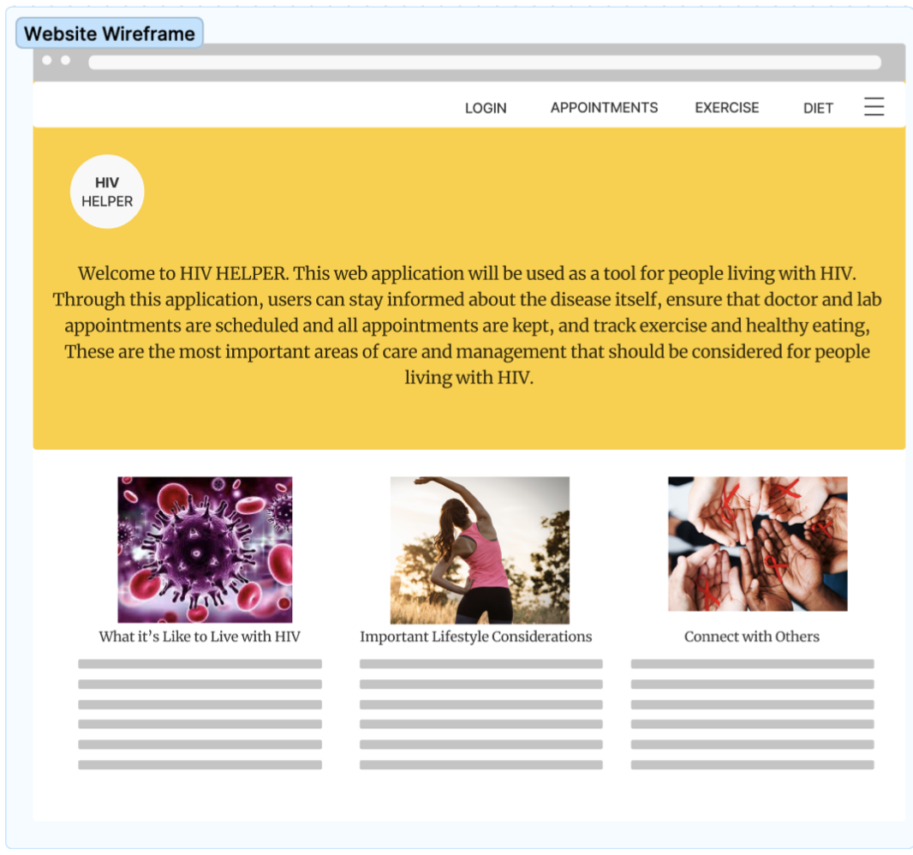
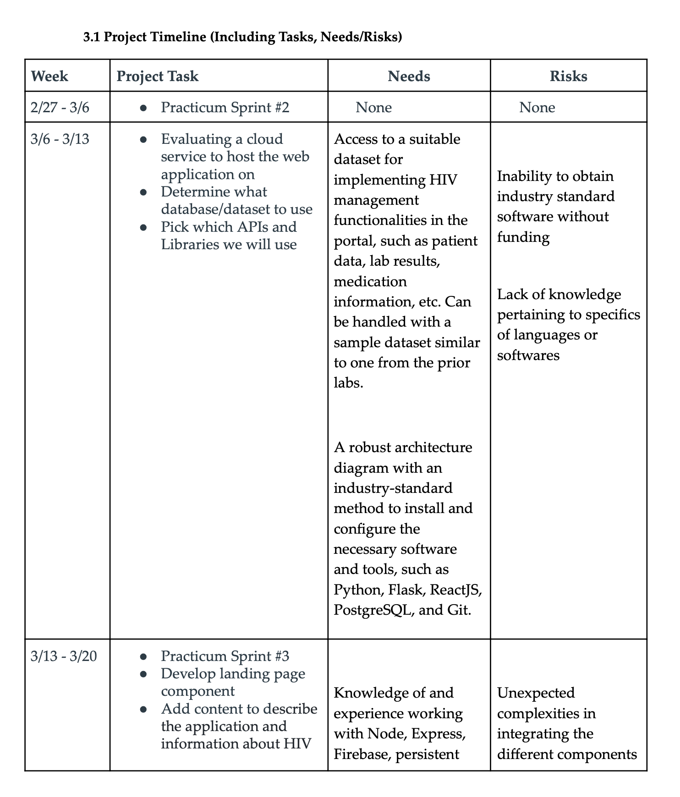
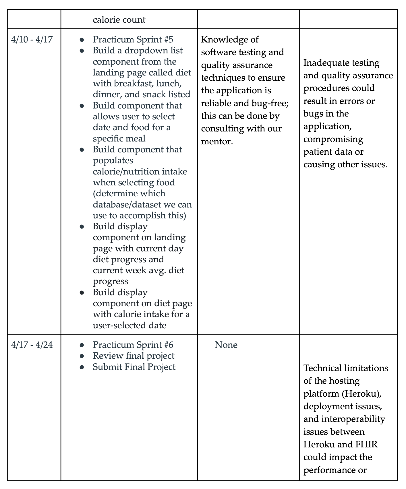

# Project Planning (Updated Practicum Sprint #2)
## Vedant Bhat, Ritvik Bhagawatula, Henna Mian, Shruthi Saravanan, Nishant Thangada

## vbhat24@gatech.edu, rbhagawatula3@gatech.edu, hmian31@gatech.edu, ssaravanan9@gatech.edu, nthangada3@gatech.edu

# PROJECT RESEARCH 

## 1.1 Background

Human Immunodeficiency Virus (HIV) is a chronic, life-threatening disease that affects millions of people worldwide. According to the World Health Organization (WHO), there were approximately 38 million people living with HIV at the end of 2019, and 690,000 people died from HIV-related illnesses in that same year. While significant progress has been made in HIV prevention and treatment, there is still no cure for the disease, and individuals with HIV must manage their condition for the rest of their lives.

The management of HIV goes beyond controlling the condition with drugs and medical appointments. A healthy lifestyle is also crucial for people living with HIV to maintain. Exercise and healthy eating can help improve overall health, boost the immune system, and reduce the risk of developing other health problems, such as heart disease and diabetes. Additionally, staying informed about the disease and any new medical developments is crucial for individuals with HIV to manage their condition effectively.

In addition, the management of HIV has evolved significantly over the years. With the introduction of antiretroviral therapy (ART) in the mid-1990s, HIV has become a chronic condition that people can manage with medication. ART works by suppressing the virus, reducing the amount of HIV in the body, and allowing the immune system to recover. However, ART is not a cure, and people with HIV must take medication for the rest of their lives to manage their condition.

Despite the availability of ART, adherence to medication remains a challenge for many people living with HIV. Adherence rates vary depending on the population and the seing, but studies have shown that approximately 50% of people living with HIV have suboptimal adherence to ART. Poor adherence can lead to drug resistance, treatment failure, and disease progression.

To improve adherence and overall management of HIV, various interventions have been developed over the years. One such intervention is mHealth, which involves the use of mobile devices and applications to improve health outcomes. Studies have shown that mHealth interventions can improve adherence to ART and overall health outcomes in people living with HIV. A web application that addresses the needs of people living with HIV by helping them manage their appointments, track their exercise and diet, and stay informed about the latest developments in HIV research and treatment would be a valuable tool for individuals living with HIV.

In conclusion, HIV is a chronic, life-threatening disease that affects millions of people worldwide. While significant progress has been made in HIV prevention and treatment, there is still no cure for the disease, and individuals with HIV must manage their condition for the rest of their lives. A web application that addresses the needs of people living with HIV would be a valuable tool to improve adherence to medication, promote healthy lifestyle behaviors, and help people with HIV manage their condition more effectively.

## 1.2 Justification

The HIV Management Web Application is a valuable project that can significantly improve the quality of life for individuals living with HIV. HIV care goes beyond just medication, and lifestyle management is essential for individuals living with HIV. Research has shown that regular exercise and healthy eating can improve the immune function of individuals living with HIV and reduce the risk of developing comorbidities such as cardiovascular disease, diabetes, and certain cancers.

Moreover, individuals living with HIV require ongoing education about the disease and the latest medical developments. In many cases, individuals may not have access to comprehensive HIV care, and managing their condition can be challenging. Therefore, the development of an HIV Management Web Application that focuses on lifestyle management, appointment scheduling, and staying informed about the disease can be an effective solution for improving HIV care.

In addition, the proposed web application will be a valuable tool for individuals living with HIV, especially those in low-income communities and resource-limited seings. According to the World Health Organization, over 38 million people worldwide were living with HIV at the end of 2019, and access to comprehensive HIV care is still a major challenge in many parts of the world. The HIV Management Web Application can help bridge this gap and provide individuals with the necessary tools to manage their condition and improve their quality of life.

## 1.3 Solution

The solution we propose is the development of a web application that will help individuals living with HIV manage their condition by providing tools for appointment scheduling, exercise tracking, meal planning, and disease education. The application will have a user-friendly interface that will enable users to easily track their progress and monitor their health. It will also offer personalized recommendations based on individual preferences and health goals, providing a comprehensive solution for managing HIV.

The appointment scheduling feature will allow users to set reminders for their doctor and lab appointments, ensuring that they keep all scheduled appointments and receive the necessary medical care. The exercise tracking feature will enable users to track their physical activity levels and set personalized fitness goals. This will help them maintain a healthy weight, reduce stress, and strengthen their immune system.

The meal planning feature will provide users with healthy meal options and allow them to create personalized meal plans based on their preferences and dietary restrictions. This will help individuals with HIV maintain a healthy diet, which is crucial for managing the condition. Finally, the disease education feature will provide up-to-date information on HIV and its treatment, empowering users to make informed decisions about their health.

Overall, the HIV Management Web Application will provide a comprehensive solution for individuals living with HIV to manage their condition and maintain a healthy lifestyle. By offering personalized recommendations and tracking tools, the application will empower users to take control of their health and improve their quality of life

# TECHNICAL DESIGN 

## 2.1 Tools/Technology

 - Programming Languages/Frameworks:
	- JavaScript
	- HTML
	- CSS
- Frontend:
	- ExpressJS
	- HTML
	- CSS
	- JavaScript
- Database:
	- Firebase
- Hosting/Deployment:
	- Heroku
- APIs and Libraries
	- Express-Session (for logging user data and persistence)
	- Express/EJS (for routing requests)
	- NodeJS (for api request processing)
	- Firebase API (for database queries)
	- Firebase Admin (for secure authentication of users)

## 2.3 Architecture

View the architecture and user diagrams in ./design.md

## 2.4 Screen Mock-up (Early thoughts)

# IMPLEMENTATION PLAN

# CITATIONS

1.  World Health Organization. (2020). HIV/AIDS. hps://www.who.int/news-room/fact-sheets/detail/hiv-aids
    
2.  Ware, N. C., Wya, M. A., & Tugenberg, T. (2011). Development of a decision-making tool to facilitate HIV disclosure for women. Journal of the Association of Nurses in AIDS Care, 22(1), 37–49. hps://doi.org/10.1016/j.jana.2010.05.002
    
3.  Simoni, J. M., Kutner, B. A., Horvath, K. J., & Orellana, E. R. (2006). Counselor-delivered prevention interventions for HIV positive individuals. Current HIV/AIDS Reports, 3(4), 171–179. hps://doi.org/10.1007/s11904-006-0015-5
    
4.  Bärnighausen, T., Chaiyachati, K., Chimbindi, N., Peoples, A., Haberer, J., Newell, M.-L., & Tanser, F. (2017). Interventions to increase antiretroviral adherence in sub-Saharan Africa: A systematic review of evaluation studies. The Lancet HIV, 4(11), e545–e555. hps://doi.org/10.1016/S2352-3018(17)30156-0
    
